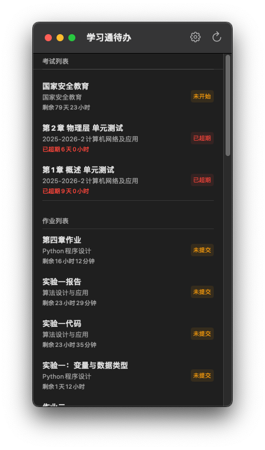
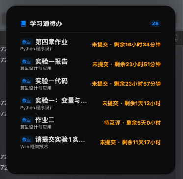
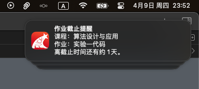

# HomeworkToDo (学习通待办)

> **💡 开发者说明**：本项目主要由 AI 辅助生成，作者本人的 Swift 基础较弱。目前应用处于 **"it just works"**（能跑就行而且用着还不错）的状态，暂未处于活跃开发期。非常期待并欢迎各位提交建设性的 PR 来一起完善它！

HomeworkToDo 是一款采用 Swift 和 SwiftUI 原生构建的应用程序，支持在 macOS 和 iOS 设备上运行。该项目旨在帮助学生快速查看和管理他们在“学习通（超星）”平台上的待办作业和考试任务。

## ✨ 主要功能

- **多平台原生体验**：基于 SwiftUI 搭建，完美适配 macOS 与 iOS 界面。
- **作业与考试拉取**：自动抓取学习通账户下的各类作业与考试列表。
- **自定义刷新频率**：支持后台自动定期刷新待办信息。
- **消息提醒**：在作业/考试即将截止时（如提前 1 小时或 24 小时），发送本地通知提醒。
- **桌面/主屏幕小组件 (Widget)**：支持 iOS 桌面小组件及 macOS 通知中心小组件，无需打开应用即可随时浏览最新待办事项。
- **课程过滤**：支持指定查看某些特定课程的作业与考试。

## 📸 运行截图

本小工具最精髓的功能在于**原生且可高度自定义时间的通知推送**，让你再也不会错过任何待办截止日期。

| 原生应用界面 | 桌面小组件 (Widget) | 推送通知 |
| :---: | :---: | :---: |
|  |  |  |

## 🛠️ 安装与运行

### 环境要求
- **macOS** 13.0+ / **iOS** 16.0+ (根据具体 Target 要求)
- **Xcode** 15.0 或更新版本
- **Swift** 5.9+

### 编译步骤

1. 克隆本项目到本地：
   ```bash
   git clone https://github.com/YourUsername/HomeworkToDo.git
   ```
2. 在 Xcode 中打开 `HomeworkToDo.xcodeproj`。
3. 等待 Xcode 自动拉取和解析本地 Package 依赖（位于 `xxt-swift` 目录下）。
4. 选择对应的 Target（如 iOS 模拟器或您的 Mac 本地）。
5. 签名并在 Xcode 中配置好您的 Apple ID（用于真机调试或运行 Widget）。
6. 点击 `Run` (⌘ + R) 编译并运行项目。

## 📦 项目结构

- `HomeworkToDo/`：主 App 源码目录（包含 `ContentView` 等 SwiftUI 视图文件）。
- `HomeworkWidget/`：Widget Extension 源码，提供桌面小组件的 UI 及逻辑功能。
- `xxt-swift/`：本地 Swift Package，主要包含了与学习通服务交互的逻辑 (`XXTCore`)、数据模型与请求解析。

## ⚠️ 免责声明

本项目仅供学习和交流使用。开发者与“超星/学习通”官方无任何关联。请妥善保管您的账号及密码，切勿将敏感信息放置于公开的源码仓库中。使用者因不当使用本软件造成的任何账号风险或其他问题，由使用者自行承担。

## 📄 许可证

本项目所含的 `xxt-swift` 遵循具体的开源协议（请参阅对应的 `LICENSE.txt` 文件）。
